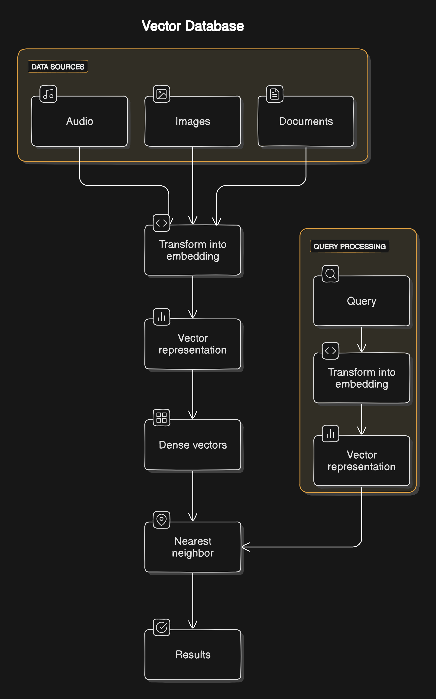

# Vector Search
The Traditional keyword-based search systems, while effective in some scenarios, often fall short when dealing with complex data types such as images, audio, or even richly nuanced textual information. This is where vector search comes into play.Vector search offers a robust solution for finding the most relevant items based on their numerical representations. Vector search involves converting data (such as text, images, or other entities) into embeddings(numerical vectors in a high-dimensional space). These vectors capture the context of the data in addition to using keyword matching. The data points closer to each other in meaning, are placed closer to each other.

# How Vector Search Works
## 1. Vector Representation
The first step in vector search is transforming data into vector representations (Embeddings). Embeddings are dense vector representations of data that capture the semantic meaning and associations of text, images, and other data types, placing similar meanings closer together in vector space. They are fundamental to vector search as they allow for the comparison of data in a continuous vector space. Various types of data, including words, sentences, documents, and images, can be converted into embeddings.
For textual data, techniques like Word2Vec, GloVe, or more advanced transformer-based models like BERT are commonly used. These models pick patterns or representation of data and generate embeddings, preserving the semantic meaning.
For example, consider two sentences:

* "The quick brown fox jumps over the lazy dog."
* "A fast, dark-colored fox leaps over a sleepy canine."
Despite using different words, these sentences convey similar meanings. Traditional keyword-based search might not recognize their similarity, but vector representations can capture the semantic essence, placing them close together in vector space.

## 2. Similarity Measurement
Once data is represented as vectors, the next step is to measure the similarity between these vectors, and the data points closer to each other in terms of meaning are placed closer to each other. Common metrics include:

* Cosine Similarity: Measures the cosine of the angle between two vectors. A cosine similarity of 1 indicates identical vectors, while -1 indicates diametrically opposed vectors.
* Euclidean Distance: Measures the straight-line distance between two vectors in the vector space. Smaller distances indicate higher similarity.
* Dot Product: Measures the magnitude of the projection of one vector onto another. A higher dot product suggests greater similarity.

The choice of metric depends on the specific application and the nature of the data.These vectors are stored in a vector database or an index.

When a query is made, it is also converted into a vector.The query vector is compared with the indexed vectors using similarity measures like cosine similarity or Euclidean distance.The most similar items are retrieved and presented as search results.

## Indexing and Search
Efficient storage and retrieval of data are critical for vector databases. Indexing methods ensure that data is managed optimally, allowing for fast and accurate searches. Different indexing techniques are used to achieve this efficiency.

### Applications of Embeddings
* Natural Language Processing (NLP): Embeddings are widely used in NLP tasks such as text classification, sentiment analysis, and machine translation.
* Search and Information Retrieval: Embeddings enable semantic search, where the search system understands the context and meaning behind queries to return more relevant results.
* Recommendation Systems: Embeddings help in finding similar items, such as products or content, based on user preferences.
"
By leveraging embeddings, we can build more intelligent and context-aware systems that go beyond simple keyword matching to understand the deeper meaning of the data.

## Available Libraries to implement vector search
Faiss (Facebook AI Similarity Search): An open-source library developed by Facebook AI, designed for efficient similarity search and clustering of dense vectors. Faiss supports both exact and approximate nearest neighbor searches.

Annoy: A C++ library with Python bindings, Annoy is designed for finding nearest neighbors in large, high-dimensional datasets. It builds a forest of random projection trees and searches them independently.

Milvus: An open-source vector database designed to manage, index, and search massive amounts of vector data. Milvus supports various indexing methods and integrates well with machine learning frameworks.