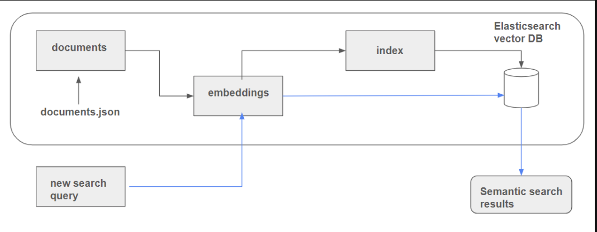

# Semantic Search with Elasticsearch
Elasticsearch, is a powerful open-source search engine, that has been used for full-text search, analytics, and data visualization. Traditionally, Elasticsearch has been known for its ability to perform keyword-based search, where documents are matched based on exact or partial keyword matches. However, Elasticsearch has evolved to support semantic search—an approach that focuses on understanding the meaning behind words and phrases, rather than just matching keywords.

Semantic search in Elasticsearch enables more intuitive and context-aware search experiences, making it possible to find relevant information even when the exact keywords are not present in the query. This article will explore how semantic search can be implemented in Elasticsearch, its benefits, and practical use cases.

## Semantic Search
Semantic search is a technique that goes beyond traditional keyword-based search by considering the context, intent, and meaning of the search query. Unlike keyword search, which focuses on literal matches, semantic search understands the relationships between words and concepts, enabling more accurate and relevant search results.

For example, in a keyword-based search, a query like "laptop battery life" might return documents containing those exact words. However, a semantic search could return documents that discuss related concepts like "long-lasting laptops," "energy-efficient devices," or even "portable computers with extended battery life."

## How Elasticsearch Supports Semantic Search
Elasticsearch supports semantic search through a combination of techniques, including:

* Vector Representations: Using pre-trained models like BERT (Bidirectional Encoder Representations from Transformers) to convert text into dense vector embeddings that capture semantic meaning.

* Similarity Scoring: Measuring the similarity between query vectors and document vectors to rank search results based on semantic relevance.

* Custom Analyzers: Creating custom tokenizers, filters, and analyzers that preprocess text data in ways that enhance semantic understanding.

* Integration with Machine Learning Models: Leveraging machine learning models that are integrated with Elasticsearch to perform tasks like entity recognition, sentiment analysis, and more

## Architecture - Semantic Search using Elastic Search


Two very important concepts in Elasticsearch are documents and indexes.

## Documents
A document is a collection of fields with their associated values. Each document is a JSON object that contains data in a structured format. For example, a document representing a book might contain fields like title, author, and publication date.

## Indexes
An index is a collection of documents that is stored in a highly optimized format designed to perform efficient searches. Indexes are similar to tables in a relational database, but they are more flexible and can store complex data structures.

To work with Elasticsearch, you need to organize your data into documents and then add all your documents to an index. This allows Elasticsearch to efficiently search and retrieve relevant documents based on the search queries.


# Implementing Semantic Search in Elasticsearch
## 1. Setting Up Elasticsearch
First, ensure that you have Elasticsearch up and running.You can do this by starting a Docker container for Elasticsearch, to connect to elasticsearch remotely:
```
docker run -it \
    --rm \
    --name elasticsearch \
    -p 9200:9200 \
    -p 9300:9300 \
    -e "discovery.type=single-node" \
    -e "xpack.security.enabled=false" \
    docker.elastic.co/elasticsearch/elasticsearch:8.4.3

```

## 2 Data Loading and Preprocessing
In this step, we will load the documents.json file and preprocess it to flatten the hierarchy, making it suitable for Elasticsearch. The documents.json file contains a list of courses, each with a list of documents. We will extract each document and add a course field to it, indicating which course it belongs to.
```
import json

with open('documents.json', 'rt') as f_in:
    docs_raw = json.load(f_in)

```
Elasticsearch requires to have everything on the same level of hierachry, in this case we have two levels, course and documents
```
documents = []

for course_dict in docs_raw:
    for doc in course_dict['documents']:
        doc['course'] = course_dict['course']
        documents.append(doc)

documents[1]
#Output
{'text': 'GitHub - DataTalksClub data-engineering-zoomcamp#prerequisites',
 'section': 'General course-related questions',
 'question': 'Course - What are the prerequisites for this course?',
 'course': 'data-engineering-zoomcamp'}

```
## 3 Create Embeddings Using Pretrained Models
To perform semantic search, we need to convert our documents into dense vectors (embeddings) that capture the semantic meaning of the text. We will use a pre-trained model from the Sentence Transformers library to generate these embeddings. These embeddings are then indexed into Elasticsearch. These embeddings enable us to perform semantic search, where the goal is to find text that is contextually similar to a given query.

The text and question fields are the actual data fields containing the primary information, whereas other fields like section and course are more categorical and less informative for the purpose of creating meaningful embeddings.

* Install the sentence_transformers library.
* Load the pre-trained model and use it to generate embeddings for our documents.
```
from sentence_transformers import SentenceTransformer
model = SentenceTransformer("all-mpnet-base-v2")

#created the dense vector using the pre-trained model
operations = []
for doc in documents:
    # Transforming the title into an embedding using the model
    doc["text_vector"] = model.encode(doc["text"]).tolist()
    operations.append(doc)


```
## 4 Connecting to Elasticsearch
In this step, we will set up a connection to an Elasticsearch instance. Make sure you have Elasticsearch running.
```
from elasticsearch import Elasticsearch

# Connect to the Elasticsearch instance
es_client = Elasticsearch('http://localhost:9200')

# Check the connection
print(es_client.info())
```
## 5 Create Mappings and Index
We will define the mappings and create the index in Elasticsearch, where the generated embeddings will also be stored.

Mapping is the process of specifying how documents and their fields are structured and indexed in Elasticsearch. Each document is composed of various fields, each assigned a specific data type.

Similar to a database schema, mapping outlines the structure of documents, detailing the fields, their data types (e.g., string, integer, or date), and how these fields should be indexed and stored.

By defining documents and indices, we ensure that an index acts like a table of contents in a book, facilitating efficient searches.
```
index_settings = {
    "settings": {
        "number_of_shards": 1,
        "number_of_replicas": 0
    },
    "mappings": {
        "properties": {
            "text": {"type": "text"},
            "section": {"type": "text"},
            "question": {"type": "text"},
            "course": {"type": "keyword"},
            "text_vector": {"type": "dense_vector", "dims": 768, "index": True, "similarity": "cosine"},
        }
    }
}

index_name = "course-questions"

# Delete the index if it exists
es_client.indices.delete(index=index_name, ignore_unavailable=True)

# Create the index
es_client.indices.create(index=index_name, body=index_settings)
```
## 6 Adding Documents to the Index
We then add the preprocessed documents along with their embeddings to the Elasticsearch index. This allows Elasticsearch to store and manage the documents efficiently, enabling fast and accurate search queries.
```
for doc in operations:
    try:
        es_client.index(index=index_name, document=doc)
    except Exception as e:
        print(e)
```
## 7 Querying the Search Engine
When a user inputs a search query, it is converted into embeddings and searched within the Elasticsearch index. The results are scored based on their relevance to the query.
```
search_term = "windows or mac?"
vector_search_term = model.encode(search_term)

query = {
    "field": "text_vector",
    "query_vector": vector_search_term,
    "k": 5,
    "num_candidates": 10000, 
}

res = es_client.search(index=index_name, knn=query, source=["text", "section", "question", "course"])
res["hits"]["hits"]
```
## Perform Keyword Search & Advanced Search(Filtering the results)
Anytime you are directly using the users input and passing that information into your search function, that becomes a keyword seard.
```
response = es_client.search(
    index=index_name,
    query={
        "bool": {
            "must": {
             "multi_match": 
                        {"query": "windows or python?", 
                         "fields": ["text", "question","course","title"],
                         "type": "best_fields"
                        }
                    },
            "filter": {
                "term": {
                        "course": "data-engineering-zoomcamp"
            }
        }
        }
    }
)
```
## Perfoming Semantic Search and Advanced Search
In order for elasticsearch to perfom semantic search, we should pass the information we receive from the end user and convert it into a vector embedding and that vector embedding is the one that is passed into the search function.
```
knn_query= {
    "field": "text_vector",
    "query_vector":vector_search_term,
    "k": 5,
    "num_candidates" : 10000
}
response=es_client.search(index=index_name,
                          query={
                              "match": {
                                  "course": "data-engineering-zoomcamp"
                              },
                          },
                           knn=knn_query,
                          size=5,
                          explain=True
                         )      
                            

```
Here's a brief look at the main steps:

Convert the search term received from the end user into a vector embedding.
* Pass this vector embedding into the advanced semantic search function.
* Restrict the results to a specific section, in this case, "General course-related questions". Similarly, it can be restricted to a specific course say "Data Engineering Zoom Camp."
One notable difference between basic and advanced semantic search lies in the scoring of results. Basic semantic search scores range between 0 and 1, where 0 indicates a poor match and 1 indicates an excellent match. In contrast, advanced semantic search scores can exceed 1. This variation can be perplexing, but it is crucial to validate the results for their relevance rather than focusing solely on the score range.

Explaining Scores with Explain Keyword
To further understand score calculations, Elasticsearch provides the explain=true keyword. This tool elucidates how scores are computed, offering valuable insights. Armed with this information, one can develop custom scoring functions that align better with specific user or business needs.

In the next chapter, we will explore how to evaluate retrieval performance. 